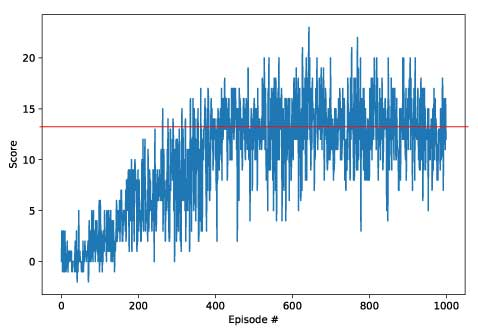
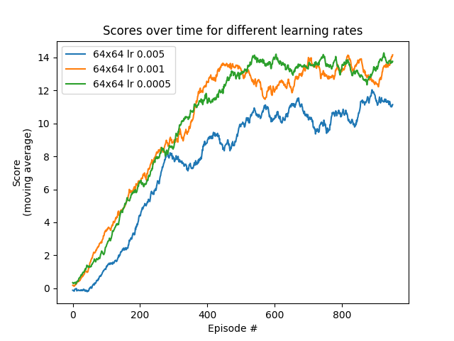
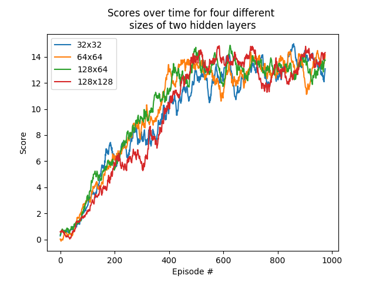

# Project 1 - Navigation with a DQN agent
This folder contains the solution to project 1 on navigation for the Udacity Nanodegree.

In this project an agent is trained to **collect yellow bananas (+1)** while avoiding blue bananas (-1) in a 3D world. The goal of the agent is to maximize its reward by collecting as many yellow bananas as possible during one episode. The **Unity ML-Agents** environment is employed for the training environment. The simulation contains a single agent that navigates a large environment. The solution implements a **Deep Q-Network (DQN)** and learns to collect an average score of more than +13 after around 500 episodes, but performance improves up to around 900 episodes.

## Project Details

### Environment Details
The state space has 37 dimensions containing the agent's velocity and distance measurements in front of the agent. Based on this information, the agent learns how to apply four actions:
* 0: move forward.
* 1: move backward.
* 2: turn left.
* 3: turn right.

The task is episodic, and the environment is considered solved when the agent gets an average score of +13 over 100 consecutive episodes.

### Learning Algorithm
The learning algorithm applied is a Deep Q-Network (DQN) [Deepmind](http://www.davidqiu.com:8888/research/nature14236.pdf). The model architecture consists of an input layer of size 37, two fully-connection hidden layers, and an output layer of size 4 (for four actions). 

Different sizes have been tried for the two hidden layers: (32,32), (64,64), (128,64), and (128,128). Though performance was very similar, (64,64) and (128,128) seemed to perform slightly better. Se result section below for graphs.

Different learning rates were selected and tested with the (64,64) hidden layer sizes. The following learning rates were tested: 0.005, 0.001, and 0.0005. Se result section below for graphs.

ε-greedy is applied as the policy. Epsilon starts at 1.0, decays with a rate of 0.995, and ends at a minimum of 0.1. 

The reward function is based on providing +1 for a yellow banana, and -1 for a blue banana respectively with a discount rate ɣ = 0.99. A replay memory of size 100.000 was selected with mini-batch size of 64.

ReLU (Rectified Linear Unit) is used for the activation function.

## Results
Video: [YouTube.com](https://youtu.be/laOg6DYBc6c)

**Untrained agent:**

Below you see the untrained agent taking random actions in the environment. The agent does not know how to act in the environment, or that bananas yield a reward (+1 or -1). Next, you see the final trained agent, and how it performs during final training and evaluation.

**Trained agent:**

Below you see the agent after training. After several episodes of interacting with the environment, the agent learns that it yields good reward to collect yellow bananas.

The submission reports the number of episodes needed to solve the environment.

## Getting Started
### Installation

Installing PyTorch
* PyTorch (install from https://pytorch.org)

It is recommended to install other dependencies through **Anconda**: https://anaconda.org/
* Python 3.6
* pickle
* numpy

To create an environment it is recommended to follow the guildelines at the Anaconda website. In general you would want to do the following

**Linux and Mac:**

    conda create --name drlnd python=3.6
    source activate drlnd

**Windows**

    conda create --name drlnd python=3.6 
    activate drlnd

The unity environment needed for this assignment can be found in the folder **/unity-ml-agents/**.

### Running the code

**Training the agent**

Before training the agent, hyperparameters can be set in **agent.py**. If you want to change the neural network, do so in **model.py**. To start training the agent run the following command:

    $ python train_agent.py

When training is done, the best model weights are saved in **/checkpoints/checkpoint.pth** and the scores during training in **scores.p**.

**Evaluating the agent**

When evaluating the trained agent, set the path in **evaluate.agent.py** for **saved_model_weights = 'your_file.pth'** to your saved weights, and then run the following to see the agent in action:

    $ python evaluate_agent.py

## Ideas for Future Work
For improving the agent in the future, several ideas can be implemented e.g **Double DQN** to cope with overestimation, **Dueling DQN** to decouple the value and advantage, and also **Prioritized Experience Replay** can be interesting in order to make better use of the stored experience.

## License
GPL-3.0

## Author
Simon Bøgh
