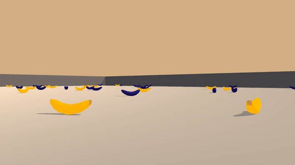
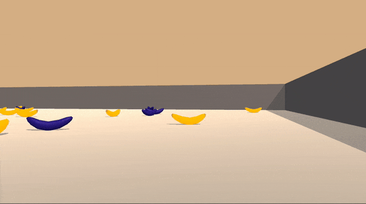

# Project 1 - Navigation with a DQN agent
This repository presents the solution to project 1 on navigation for the Udacity Nanodegree.

## Results
Untrained agent:

Trained agent:

## License
GPL-3.0

## Author
Simon Bøgh
