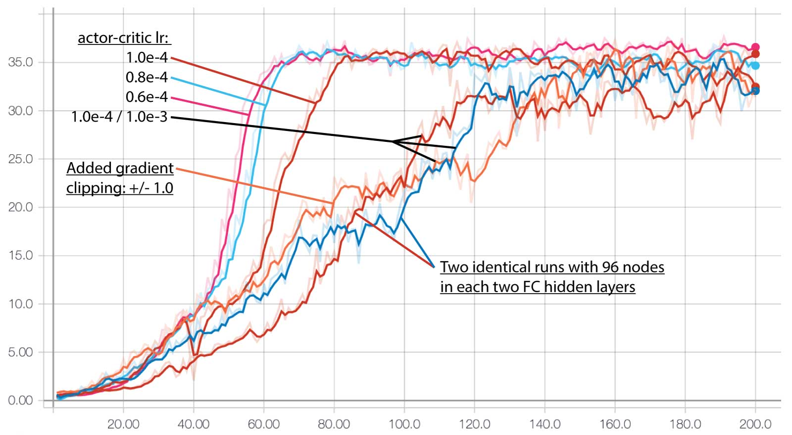
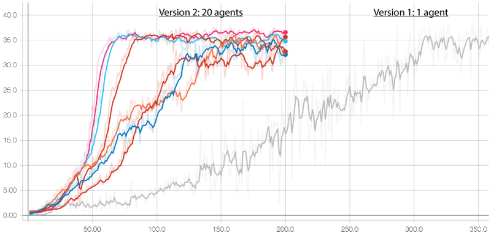

# Project 2 - Continuous Control with DDPG agent
This folder contains the solution to project 2 on continous control for the Udacity Nanodegree.

In this project a double-jointed arm is trained to reach target locations. A reward of +0.1 is provided for each step that the agent's hand is in the goal location. Thus, the goal of the agent is to maintain its position at the target location for as many time steps as possible.

The implementation details can be found in [**REPORT.md**](REPORT.md).

## Project Details

### Environment Details
The observation space consists of 33 variables corresponding to position, rotation, velocity, and angular velocities of the arm. 

Each action is a vector with four numbers, corresponding to **torque applicable to two joints**. Every entry in the action vector should be **a number between -1 and 1**.

For this project, two separate versions of the *Reacher* Unity environment are provided:
* Version 1: The first version contains a single agent
* Version 2: The second version contains 20 identical agents, each with its own copy of the environment  

The task is episodic, and the environment is considered solved when the agent gets an average score of +30 over 100 consecutive episodes.

## Getting Started
### Installation

Installing PyTorch
* PyTorch 0.4.x install from https://pytorch.org or https://pytorch.org/get-started/previous-versions/

It is recommended to install other dependencies through **Anconda**: https://anaconda.org/
* Python 3.6
* pickle
* numpy
* tensorboardx: tensorboardX is used for saving data to visualise the training process from PyTorch to tensorboard 

To create an Anaconda virtual environment for Python it is recommended to follow the guildelines at the Anaconda website. In general you would want to do the following in the terminal:

**Linux and Mac:**

    conda create --name drlnd python=3.6
    source activate drlnd

**Windows**

    conda create --name drlnd python=3.6
    activate drlnd

The unity environment needed for this assignment can be found in the folder **/unity-ml-agents/**. Here you will find environments for Mac, Linux, and Windows.

### Running the code

**Training the agent**

Before training the agent, hyper-parameters can be set in **ddpg_agent.py**. If you want to change the neural networks for the actor and critic, do so in **ddpg_model.py**. 

To start training the agent run the following command:

    $ python train_ddpg_agent.py

tensorboard can be used to visualise the training process (mean reward) in your browser. Start tensprboard by running the following command:

    $ tensorboard --logdir runs

*"runs"* is a folder created by tensorboardX in the root folder. It contains the events defined in *train_ddpg_agent.py*.

When training is done, the best model weights are saved as **checkpoint_actor.pth** and **checkpoint_critic.pth**.

## Results
<!--
**FIX VIDEO**
Video: [YouTube.com](https://youtu.be/laOg6DYBc6c)
-->

Below are the training results from Version 1 and 2 of the environment. First, Version 2 was solved. Afterwards Version 1 was trained with identical network architecture and hyper-parameters as Version 2.

Detailed results are found in [**REPORT.md**](REPORT.md).

### Version 2: 20 agents

<!--  -->

### Version 1: 1 agent

## Acknowledgement
The initial code is derived from the DDPG example from the Udacity github repository, and then built upon and tuned for the given case.

## License
GPL-3.0

## Author
Simon Bøgh
