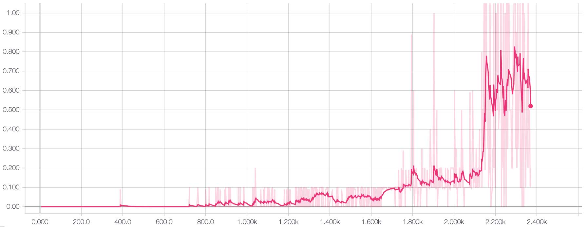

# Project 3 - Collaboration and Competition

This folder contains the solution to project 3 on collaboration and competetion for the Udacity Nanodegree.

In this project, two agents learn to play [Tennis](https://github.com/Unity-Technologies/ml-agents/blob/master/docs/Learning-Environment-Examples.md#tennis).

The implementation details can be found in [**REPORT.md**](REPORT.md).

## Project Details

### Environment Details

In this environment, two agents control rackets to bounce a ball over a net. **If an agent hits the ball over the net, it receives a reward of +0.1**.  **If an agent lets a ball hit the ground or hits the ball out of bounds, it receives a reward of -0.01**.  Thus, the goal of each agent is to keep the ball in play.

**The observation space consists of 8 variables** corresponding to the position and velocity of the ball and racket. Each agent receives its own, local observation.  

**Two continuous actions** are available, corresponding to movement toward (or away from) the net, and jumping. 

**The task is episodic**, and in order to solve the environment, **the agents must get an average score of +0.5 (over 100 consecutive episodes, after taking the maximum over both agents)**. Specifically,

* After each episode, we add up the rewards that each agent received (without discounting), to get a score for each agent. This yields 2 (potentially different) scores. We then take the maximum of these 2 scores.
* This yields a single **score** for each episode.

The environment is considered solved, when the average (over 100 episodes) of those **scores** is at least +0.5.

## Getting Started
### Installation

Installing PyTorch
* PyTorch 0.4.x install from https://pytorch.org or https://pytorch.org/get-started/previous-versions/

It is recommended to install other dependencies through **Anconda**: https://anaconda.org/
* Python 3.6
* pickle
* numpy
* tensorboardx: tensorboardX is used for saving data to visualise the training process from PyTorch to tensorboard 

To create an Anaconda virtual environment for Python it is recommended to follow the guildelines at the Anaconda website. In general you would want to do the following in the terminal:

**Linux and Mac:**

    $ conda create --name drlnd python=3.6
    $ source activate drlnd

**Windows**

    $ conda create --name drlnd python=3.6
    $ activate drlnd

The unity environment needed for this assignment can be found in the folder **/unity-ml-agents/**. Here you will find environments for Mac, Linux, and Windows.

**Unity Environments**
1. Download the environment from one of the links below.  You need only select the environment that matches your operating system:
    - Linux: [click here](https://s3-us-west-1.amazonaws.com/udacity-drlnd/P3/Tennis/Tennis_Linux.zip)
    - Mac OSX: [click here](https://s3-us-west-1.amazonaws.com/udacity-drlnd/P3/Tennis/Tennis.app.zip)
    - Windows (32-bit): [click here](https://s3-us-west-1.amazonaws.com/udacity-drlnd/P3/Tennis/Tennis_Windows_x86.zip)
    - Windows (64-bit): [click here](https://s3-us-west-1.amazonaws.com/udacity-drlnd/P3/Tennis/Tennis_Windows_x86_64.zip)
    
    (_For Windows users_) Check out [this link](https://support.microsoft.com/en-us/help/827218/how-to-determine-whether-a-computer-is-running-a-32-bit-version-or-64) if you need help with determining if your computer is running a 32-bit version or 64-bit version of the Windows operating system.

    (_For AWS_) If you'd like to train the agent on AWS (and have not [enabled a virtual screen](https://github.com/Unity-Technologies/ml-agents/blob/master/docs/Training-on-Amazon-Web-Service.md)), then please use [this link](https://s3-us-west-1.amazonaws.com/udacity-drlnd/P3/Tennis/Tennis_Linux_NoVis.zip) to obtain the "headless" version of the environment.  You will **not** be able to watch the agent without enabling a virtual screen, but you will be able to train the agent.  (_To watch the agent, you should follow the instructions to [enable a virtual screen](https://github.com/Unity-Technologies/ml-agents/blob/master/docs/Training-on-Amazon-Web-Service.md), and then download the environment for the **Linux** operating system above._)

2. Place the file in the folder in the `unity-ml-agents/` folder, and unzip (or decompress) the file. 

### Running the code

**Training the agent**

Before training the agent, hyper-parameters can be set in **ddpg_agent.py**. If you want to change the neural networks for the actor and critic, do so in **ddpg_model.py**. 

To start training the agent run the following command:

    $ python train_agent.py

tensorboard can be used to visualise the training process (mean reward) in your browser. Start tensprboard by running the following command:

    $ tensorboard --logdir runs

*"runs"* is a folder created by tensorboardX in the root folder. It contains the events defined in *train_agent.py*.

When training is done, the best model weights are saved as **checkpoint_actor.pth** and **checkpoint_critic.pth**.

## Results

Below are the training results from solving the environment.

Detailed results are found in [**REPORT.md**](REPORT.md).

**128 nodes in each hidden layer**

**256 nodes in each hidden layer + batch normalization on the input**

## Acknowledgement
The initial code is derived from the DDPG example from the Udacity github repository, and then built upon and tuned for the given case.

## License
GPL-3.0

## Author
Simon Bøgh
