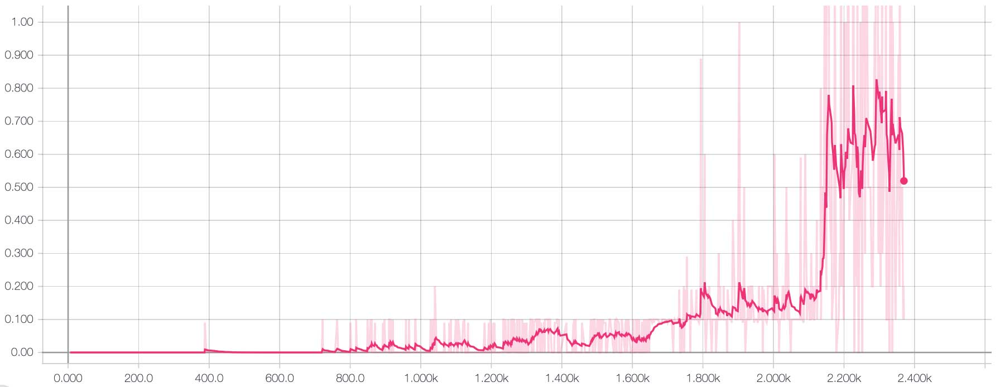
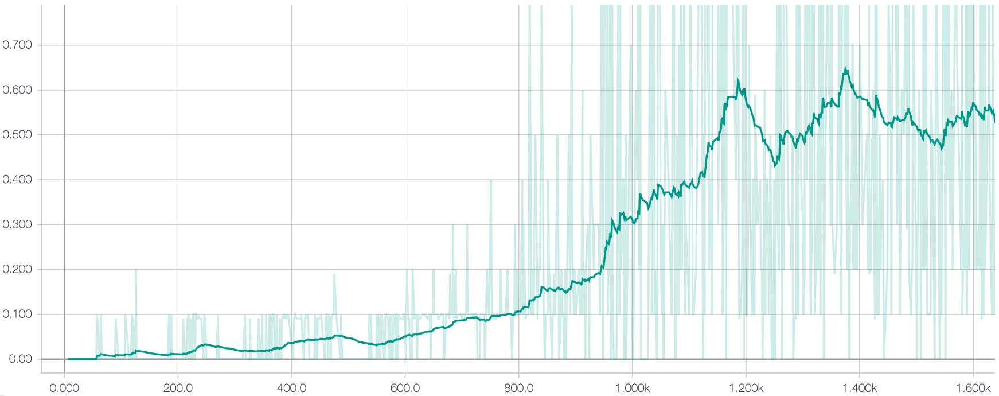

# Project 3 - Report
## Collaboration and Competition

### Implementation Details
<!--Description of the implementation.-->
For the third project the actor-critic method **Deep Deterministic Policy Gradient (DDPG)** for multiple agents with shared memory was applied - **MADDPG**.

Paper: [Lowe, Ryan, et al. "Multi-agent actor-critic for mixed cooperative-competitive environments." Advances in Neural Information Processing Systems. 2017.](https://papers.nips.cc/paper/7217-multi-agent-actor-critic-for-mixed-cooperative-competitive-environments.pdf)

### Learning Algorithm
<!-- Clearly describe the learning algorithm, along with the chosen hyperparameters. -->
<!--Also describe the model architectures for any neural networks.-->
**Multi-Agent Deep Deterministic Policy Gradient (MADDPG)**

MADDPG is an extension of DDPG for multi-agent environments. DDPG is an off-policy algorithm, and can be used for environments with continous action spaces.

The model architecture consists of an actor and critic network. The neural networks in my implementation consists of an input layer of size 8, two fully-connected hidden layers, and an output layer of size 2 for the actors and size 1 for the critic.

Different sizes were tried for the two hidden layers: (128,128), (256,256), and (512,512). The different layer sizes were evaluated until the training started to show some convergence. (256,256) performed the best and was hereafter fixed.

ReLU (Rectified Linear Unit) is used for the activation function in the actor's hidden layers and tanh on the output layer. ReLU was also applied on the hidden layers in the critic's hidden layers, and no activation on the output.

Exploration - Adding noise to the actions: To make the agents explore better, noise is added to the actions at training time. Ornstein–Uhlenbeck (OU) noise is used in this implementation as suggested in the original DDPG paper. At evaluation time, noise is not added to the actions.

As learned from project 2, in order to stabilise the learning, gradient clipping was applied to see if it would have any effect on the performance and convergence time.

Soft updates of target parameters were introduced as well as experience replay, as these two tricks are what was shown in DQN to stabilise learning when using neural networks as function approximators. 

Finally, when convergence was achieved I tuned the learning rate to 1.0e-4 for both actors and critic. 

When the training was stabilised it converged after 1150 episodes where it achieved a mean score of 0.5+ for the 100 consecutive episodes. The graphs below are smoothed, and the original training graph can be seen faded in the background. 

Batch normalization was added to the inputs and this significantly reduced the number of episodes it took to converge. However, as it was also realised in project 2, when adding batch normalization, some point after convergence, the training started to diverge, and the policy never recovered. The reason for this is unknown, and will be investigated in future work. 

Furthermore, though it takes less episodes to converge, doing the batch normalization in computational expensive often resulting in the actual training time being 2-3x longer.

**Significant changes that affected performance**
* Number of nodes in hidden layers in neural networks
* Batch normalization on the input

## Results
<!-- Video: [YouTube.com](https://youtu.be/laOg6DYBc6c) -->
<!--Plot of Rewards-->

Below are the training results the tennis environment.

A plot of rewards per episode is included below to illustrate:

* 128x128 nodes in two hidden layers **without** batch normalization
* 256x256 nodes in two hidden layers **with** batch normalization

**128 nodes in each hidden layer**

Solved around episode 2150.

**256 nodes in each hidden layer + batch normalization on the input**

Solved around episode 1150.

## Ideas for Future Work
* As with DDPG it was somewhat difficult to tune the hyper-parameters. Afgain, it would be interesting to see if other techniques suchs as TRPO and PPO would help here making it more stable and easier to tune
* Explore and understand the effects of batch normalization in greater detail. There is no doubt that batch normalization is strong mean to make training more stable and converge in less episodes, though it would be relevant to figure out why the training later on starts to diverge. This has only been experienced when adding batch normalization
